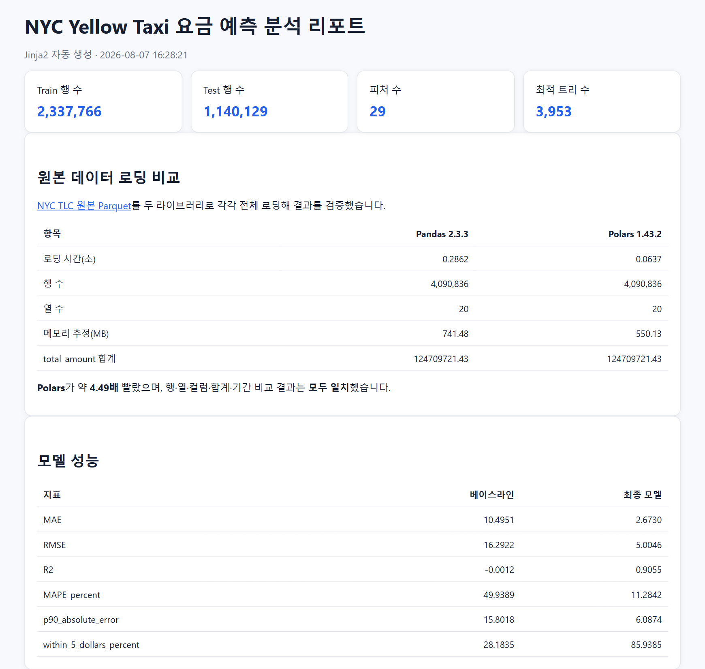
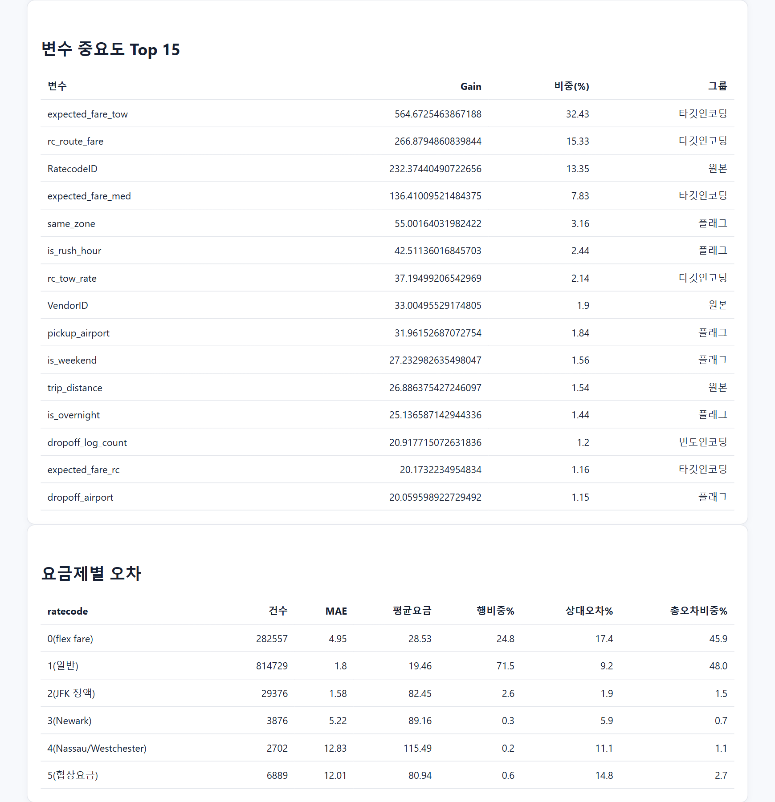

# NYC Yellow Taxi 요금 예측 분석 파이프라인

2026년 5월 NYC Yellow Taxi 운행 데이터를 정제하고, **팁을 제외한 결제 금액을 예측하는 XGBoost 모델**을 학습하는 프로젝트입니다. 원본 데이터 다운로드, Pandas/Polars 로딩 비교, 전처리, 통계·시각화, 모델 평가, Jinja2 HTML 리포트 생성까지 연결합니다.

팀 최종안은 **OOF(Out-of-Fold) 타깃 인코딩을 적용한 XGBoost**입니다. 제출 보고서 기준 MAE는 **$2.6978**, R²는 **0.9057**, 실제 요금과 ±$5 이내로 예측한 비율은 **85.89%**입니다.

> 분석 내용과 제출 성과는 「NYC Yellow Taxi 요금 예측 보고서 이준희.docx.pdf」를 기준으로 정리했습니다. 보고서의 실험 결과와 현재 저장소의 코드·저장 산출물이 다른 부분은 아래에 구분해 표시했습니다.

## 산출물 바로 보기

파이프라인을 다시 실행하지 않아도 아래 링크에서 **저장된 분석 결과와 모델 산출물**을 확인할 수 있습니다. 모든 링크는 저장소에 포함된 [`outputs copy/`](outputs%20copy/)의 기존 실행 결과를 가리킵니다.

| 분류 | 산출물 | 확인할 내용 |
|---|---|---|
| 종합 리포트 | [HTML 분석 리포트](outputs%20copy/report.html) | 데이터 로딩·통계·시각화·모델 평가 종합 |
| 모델 평가 | [성능 지표 JSON](outputs%20copy/metrics.json) | 베이스라인과 모델 성능, 학습·테스트 행 수, 피처·트리 수 |
| 오차 진단 | [요금제별 오차 CSV](outputs%20copy/error_by_ratecode.csv) | 요금제별 예측 오차와 전체 오차 기여도 |
| 모델 해석 | [변수 중요도 CSV](outputs%20copy/feature_importance.csv) | 변수별 gain, 중요도 비율, 피처 그룹 |
| 통계 검정 | [통계 분석 결과](outputs%20copy/statistics.txt) | 요금제 비교 검정과 상관 분석 |
| 로딩 비교 | [Pandas·Polars 비교 JSON](outputs%20copy/data_loading_comparison.json) | 데이터 로딩 시간과 결과 일치 여부 |
| 예측 결과 | [테스트 예측값 CSV.gz](outputs%20copy/test_predictions.csv.gz) | 실제값과 예측값 비교용 압축 CSV |
| 학습 모델 | [요금 예측 파이프라인 Joblib](outputs%20copy/fare_model_pipeline.joblib) | 피처 생성·인코딩·XGBoost를 결합한 저장 모델 |

**저장 실행 요약 · 2026-08-07 생성:** MAE **$2.6730** · RMSE **$5.0046** · R² **0.9055** · ±$5 이내 **85.94%**. 아래 본문의 제출 보고서 성능과는 별도 실행 결과입니다.

> **HTML 열람 방법:** GitHub 파일 화면에서는 HTML이 웹페이지로 실행되지 않습니다. 저장소를 ZIP으로 내려받아 압축을 풀고 `outputs copy/report.html`을 브라우저에서 열면 됩니다. 차트 파일도 같은 폴더에 유지하세요. Plotly 차트는 인터넷 연결이 필요합니다. CSV.gz는 내려받아 압축을 해제한 뒤 확인할 수 있습니다.

### HTML 리포트 미리보기

아래는 [HTML 분석 리포트](outputs%20copy/report.html)의 주요 화면을 실제 브라우저에서 캡처한 이미지입니다. **2026-08-07에 생성된 저장 리포트** 기준이며, 이미지를 클릭하면 원본 크기로 확인할 수 있습니다.

**데이터 요약 · 로딩 비교 · 모델 성능**

[](docs/images/report-overview.png)

**변수 중요도 · 요금제별 오차 진단**

[](docs/images/report-diagnostics.png)

전체 차트와 통계 결과는 [원본 HTML 리포트](outputs%20copy/report.html)를 내려받아 확인할 수 있습니다.

### 주요 차트 미리보기

원본 데이터의 품질 점검부터 정제 데이터의 분포·관계까지 대표 차트 4개를 모았습니다. 이미지를 클릭하면 원본 크기로 볼 수 있습니다.

| 원본 데이터 · 컬럼별 결측치 비율 | 정제 데이터 · 팁 제외 요금 분포 |
|:---:|:---:|
| [](outputs%20copy/visualization_raw_cell_4.png) | [](outputs%20copy/visualization_processed_cell_5.png) |
| 결측치 처리 대상 컬럼 확인 | 예측 대상의 분포와 긴 오른쪽 꼬리 확인 |

| 정제 데이터 · 요금제별 요금 분포 | 정제 데이터 · 수치형 변수 상관계수 |
|:---:|:---:|
| [](outputs%20copy/visualization_processed_cell_7.png) | [](outputs%20copy/visualization_processed_cell_11.png) |
| 요금제에 따른 요금 수준과 산포 비교 | 거리와 요금 등 변수 사이의 관계 확인 |

<details>
<summary>추가 차트와 분석 노트북 펼치기</summary>

| 구분 | 산출물 |
|---|---|
| 원본 데이터 | [이상치를 포함한 수치형 변수 분포](outputs%20copy/visualization_raw_cell_6.png) · [승객 수·요금제 빈도](outputs%20copy/visualization_raw_cell_10.png) |
| 정제 데이터 | [업체별 평균 요금](outputs%20copy/visualization_processed_cell_9.png) · [승차건수 상위 10개 지역](outputs%20copy/visualization_processed_cell_17.png) · [승객 수별 요금 분포](outputs%20copy/visualization_processed_cell_19.png) |
| 인터랙티브 HTML · 원본 | [운행 거리와 총요금](outputs%20copy/visualization_raw_plotly_1.html) |
| 인터랙티브 HTML · 정제 | [요금제별 운행 거리와 요금](outputs%20copy/visualization_processed_plotly_1.html) · [시간대별 운행 건수](outputs%20copy/visualization_processed_plotly_2.html) |
| 분석 노트북 | [원본 데이터 EDA](notebooks/visualization_raw.ipynb) · [정제 데이터 EDA](notebooks/visualization_processed.ipynb) |

인터랙티브 HTML은 위 안내에 따라 내려받아 브라우저에서 열어 주세요.

</details>

## 프로젝트 목적

시간대, 이동 거리, 요금제, 승객 수, 승하차 지역을 활용해 요금을 예측하고 다음 활용 가능성을 검토합니다. 아래 항목은 보고서에서 제안한 활용 방향이며, 현재 구현 범위는 오프라인 분석·모델 학습·리포트 생성입니다.

- **사전 요금 안내:** 승차 전 예상 결제 금액을 제공해 요금 불확실성을 줄입니다.
- **요금 정책 검토:** 시간대별 예측 요금과 할증 구조를 비교할 분석 근거를 마련합니다.
- **시간대·지역별 매출 추정:** 예상 운행 건수와 건당 예측 요금을 결합합니다.
- **기사 수익 가이드:** 시간대·거리·지역 조건에 따른 요금 수준을 비교합니다.
- **이상 결제 탐지:** 실제 결제액과 예측값의 차이가 큰 운행을 점검 후보로 선별합니다.

## 데이터와 예측 대상

| 항목 | 내용 |
|---|---|
| 원본 | NYC TLC `yellow_tripdata_2026-05.parquet`, 약 409만 행 |
| 학습 구간 | 2026년 5월 1~20일 |
| 테스트 구간 | 2026년 5월 21~31일 |
| 정제 후 데이터 규모 | 보고서 기준 train 2,337,766행 / test 1,140,129행 |
| 예측 대상 | `fare_ex_tip = total_amount - tip_amount` |
| 평가 기준선 | 학습 데이터의 평균 요금을 모든 테스트 행에 예측 |

`total_amount`에는 카드 결제 팁이 반영되지만 현금 팁은 반영되지 않는 문제를 고려해 팁을 제외한 결제 금액을 타깃으로 정했습니다. 금액 구성 항목, 결제 수단, 하차 시각, 실제 운행시간·속도는 모델 입력에서 제외합니다.

원본은 [TLC Parquet 다운로드 주소](https://d37ci6vzurychx.cloudfront.net/trip-data/yellow_tripdata_2026-05.parquet)에서 자동으로 받습니다. 현재 코드의 저장 위치는 **저장소 바로 상위 폴더**의 `yellow_tripdata_2026-05.parquet`이며, 이후 실행에서는 기존 파일을 재사용합니다.

실제 승차 전 서비스에서는 기록된 최종 `trip_distance` 대신 경로 기반 예상 거리를 입력해야 합니다. 이 저장소의 평가는 기록된 운행 거리를 사용한 오프라인 결과입니다.

## 전처리 기준

결측치 대체값과 이상치 경계는 학습 데이터에서 계산하고 테스트 데이터에 동일하게 적용합니다.

| 항목 | 처리 방식 |
|---|---|
| 날짜 | 2026년 5월 승차 기록만 남기고 날짜 기준으로 train/test 분리 |
| `RatecodeID` | 99·6 제거, 결측값은 프로젝트 내 Flex Fare 범주인 0으로 보존 |
| `store_and_fwd_flag` | `Y`인 행 제거 후 컬럼 삭제 |
| `passenger_count` | 0·결측값은 train 최빈값으로 대체, 5명 초과 제거 |
| 거리·시간 | 거리 0 이하, 운행시간 0 이하 제거 |
| 속도 이상치 | 요금제별 IQR 상한 적용, 일반 요금제는 배수 3.0, 나머지는 1.5 |
| 타깃 | 팁 제외 결제 금액이 0 이하인 행 제거 |

보고서에서는 결측 `RatecodeID`를 일괄 삭제하지 않고 Flex Fare로 보존한 판단과 전처리 기준 재검토를 통해 데이터 잔존율이 62.3%에서 85.2%로 개선되었다고 설명합니다.

**보고서와 현재 코드의 차이:** 보고서는 정상 장거리 운행 보존을 위해 거리 상한을 100마일로 변경했다고 기술합니다. 현재 `src/data_preprocessing.py`는 거리·운행시간·속도 모두에 요금제별 IQR 상한을 적용합니다. 따라서 현재 코드 재실행 시 정제 행 수와 성능이 보고서와 달라질 수 있습니다.

## 통계 분석 결과

보고서에서는 Flex Fare(`RatecodeID=0`)의 마일당 요금이 일반 요금제(`RatecodeID=1`)보다 높은지 검정했습니다.

| 분석 | 보고서 결과 |
|---|---|
| Mann-Whitney U: Flex Fare > 일반 | p=1, 해당 방향의 가설을 지지하지 않음 |
| Mann-Whitney U: Flex Fare < 일반 | p<0.0001 |
| 마일당 요금 중앙값 | Flex Fare $10.39 / 일반 $12.05 |
| Rank-biserial 효과크기 | -0.1665 |
| 거리와 팁 제외 요금의 상관 | Spearman ρ=0.8293 / Pearson r=0.8448 |

Flex Fare는 총요금이 높더라도 마일당 요금까지 높지는 않았습니다. 보고서는 긴 운행 거리에서 고정 기본요금이 분산되는 구조로 해석합니다. Welch t-test는 평균 기준으로 반대 방향의 결과를 보였으므로 평균, 중앙값, 순위 기반 검정의 차이를 함께 살펴봐야 합니다.

## 모델링과 OOF 타깃 인코딩

### 피처 구성

현재 모델은 원본 변수와 파생변수를 결합한 29개 피처를 사용합니다.

| 그룹 | 주요 변수·설계 |
|---|---|
| 원본 6개 | `trip_distance`, `passenger_count`, `RatecodeID`, `VendorID`, `PULocationID`, `DOLocationID` |
| 시간 순환 4개 | `hour_sin/cos`, `weekday_sin/cos` |
| 시간·공간 플래그 6개 | `is_weekend`, `is_rush_hour`, `is_overnight`, `same_zone`, `pickup_airport`, `dropoff_airport` |
| 빈도 인코딩 3개 | `pickup_log_count`, `dropoff_log_count`, `route_log_count` |
| 타깃 인코딩 6개 | `rc_route_rate`, `route_rate`, `pickup_tow_rate`, `rc_tow_rate`, `rc_route_rate_med`, `rc_route_fare` |
| 예상 요금 4개 | `expected_fare_rc`, `expected_fare_route`, `expected_fare_tow`, `expected_fare_med` |

요금제·경로·지역·시간대별 마일당 단가의 평균·중앙값과 요금 평균을 피처로 만듭니다. 단가에 이동 거리를 곱한 예상 요금도 함께 사용하며, 표본이 적은 그룹에는 스무딩을 적용합니다.

### 학습 흐름

1. 날짜로 분리한 train을 승차 시각순으로 정렬하고, 마지막 15%를 내부 검증에 사용합니다.
2. 학습 행의 그룹별 타깃 통계는 **5-fold OOF**로 생성합니다. 각 행이 속한 fold를 제외한 나머지 fold에서 그룹 통계를 계산해 자기 정답의 직접 반영을 줄입니다.
3. 검증·테스트 데이터에는 해당 학습 구간에서 계산한 통계를 적용합니다.
4. XGBoost의 `reg:absoluteerror` 손실을 사용하고, 최대 4,000개 트리·조기 종료 75라운드로 트리 수를 선택합니다.
5. 선택한 트리 수로 train 전체를 다시 학습한 뒤 테스트 데이터를 평가합니다.

현재 OOF 구현은 `shuffle=True`인 K-Fold이며 스무딩의 기준값은 해당 학습 데이터 전체에서 계산합니다. 따라서 날짜 기반 train/test 분리와 OOF의 역할을 구분해야 하며, 과거 행만 사용하는 시간 순 인코딩과 fold별 기준값 계산은 추가 검증 과제입니다.

### 모델 개선 과정

아래 수치는 보고서에 기록된 팀 실험 결과입니다. 중간 실험 모델 전체가 현재 실행 파이프라인에 포함된 것은 아닙니다.

| 단계 | 담당·접근 | MAE ($) | R² |
|---|---|---:|---:|
| 평균 예측 | 공통 베이스라인 | 10.4951 | -0.0012 |
| 최초 모델 | 성유정: HistGradientBoosting | 3.6677 | 0.8545 |
| 지역 정보 추가 | 김도현: XGBoost + 승하차 지역 ID | 3.0488 | 0.8914 |
| 파생변수 확장 | 성유정: XGBoost + 시간·공간·빈도 변수 | 2.7049 | 0.8972 |
| 팀 최종 채택 | 이준희: XGBoost + OOF 타깃 인코딩 | **2.6978** | **0.9057** |

## 최종 성능과 오차 진단

### 제출 보고서 기준 성능

| 지표 | 평균 예측 베이스라인 | XGBoost + OOF |
|---|---:|---:|
| MAE ($) | 10.4951 | **2.6978** |
| RMSE ($) | 16.2922 | **4.9999** |
| R² | -0.0012 | **0.9057** |
| MAPE | 49.94% | **11.50%** |
| p90 절대오차 ($) | 15.80 | **6.09** |
| ±$5 이내 예측 비율 | 28.18% | **85.89%** |

**저장 산출물과의 차이:** 현재 포함된 [outputs copy/metrics.json](outputs%20copy/metrics.json)은 별도 실행 기록으로 MAE 2.6730, RMSE 5.0046, R² 0.9055입니다. 위 표는 제출 보고서의 수치이며, 두 결과를 동일한 실행 결과로 간주하지 않습니다. 새 실행의 지표는 `outputs/metrics.json`에 저장됩니다.

### 요금제별 오차: 보고서 기준

| 요금제 | 테스트 건수 | MAE ($) | 전체 절대오차 합계 중 비중 |
|---|---:|---:|---:|
| Flex Fare | 282,557 | 4.98 | 45.7% |
| 일반 | 814,729 | 1.82 | 48.3% |
| JFK 정액 | 29,376 | 1.63 | 1.6% |
| Newark | 3,876 | 5.03 | 0.6% |
| Nassau/Westchester | 2,702 | 12.70 | 1.1% |
| 협상요금 | 6,889 | 11.97 | 2.7% |

일반·Flex Fare가 전체 절대오차의 약 94%를 차지합니다. 개선 우선순위는 건수가 많은 두 그룹과 건당 절대오차가 큰 교외·협상요금 그룹을 함께 고려할 수 있습니다.

보고서의 변수 중요도 분석에서 타깃 인코딩 그룹은 전체 gain의 65.04%, `rc_route_fare`는 단일 변수로 36.08%를 차지했습니다. Gain은 모델 내 상대적 중요도이므로, 변수를 제거한 비교 실험에서의 성능 개선량과는 구분해야 합니다.

## 팀 구성과 기여

파이썬 종합실습 2, **1반 4조** 프로젝트입니다.

| 역할 | 팀원 |
|---|---|
| 전처리·통계·시각화 | 박진서, 유영호, 이주영 |
| 모델링·리포트 생성 | 김도현, 성유정, 이준희 |

이준희는 보고서에서 다음 기여를 담당했습니다.

- B2B 관점의 요금 예측 활용 가치와 활용 기준 제안
- 팁 제외 타깃 정의 및 금액 구성 항목·실제 운행시간 등 누수 우려 피처 제외 기준 수립
- 요금제·경로·시간대별 OOF 타깃 인코딩 설계와 최종 XGBoost 모델 구현
- 요금제별 오차 진단, 피처 그룹별 중요도 분석, 모델링 결과 리포트 구성

## 저장소 구조

```text
taxi_amount_analysis_pipeline/
├── notebooks/
│   ├── visualization_raw.ipynb        # 원본 데이터 EDA
│   └── visualization_processed.ipynb  # 정제 데이터 EDA
├── src/
│   ├── data_loader.py                 # 다운로드와 Pandas/Polars 비교
│   ├── data_preprocessing.py          # 정제와 날짜 기준 train/test 분리
│   ├── statistical_analysis.py        # 가설 검정과 효과크기
│   ├── notebook_runner.py             # 노트북 실행 및 차트 저장
│   ├── modeling.py                    # 피처 생성, OOF 인코딩, XGBoost
│   └── report.py                      # Jinja2 HTML 리포트 생성
├── templates/report.html.j2
├── outputs copy/                      # 저장소에 포함된 기존 실행 결과
├── data/processed/                    # 실행 시 생성되는 정제 CSV
├── outputs/                           # 실행 시 생성되는 분석·모델·리포트
├── requirements.txt
└── run_pipeline.sh
```

기존 결과는 [HTML 리포트](outputs%20copy/report.html)에서 확인할 수 있습니다. 인터랙티브 차트까지 보려면 파일을 내려받아 브라우저에서 여세요.

## 환경 설정과 실행

### 환경 설정

저장소 루트에서 가상환경을 만들고 의존성을 설치합니다.

```bash
python3 -m venv .venv
source .venv/bin/activate
python -m pip install -r requirements.txt
```

주요 라이브러리는 Pandas, Polars, PyArrow, SciPy, scikit-learn, XGBoost, Matplotlib, Seaborn, Plotly, Jinja2입니다. 시각화 실행에는 macOS의 AppleGothic/AppleSDGothicNeo 또는 Linux의 NanumGothic 폰트가 필요합니다.

### 전체 실행

현재 `run_pipeline.sh`의 모델 import와 정제 데이터 노트북은 **`taxi_analysis_pipeline`이라는 폴더 이름을 전제로 합니다.** 전체 실행기를 사용하려면 저장소를 해당 이름의 폴더에 배치한 뒤 그 폴더에서 실행하세요. 현재 체크아웃 이름인 `taxi_amount_analysis_pipeline`에서는 해당 경로가 맞지 않습니다.

```bash
# taxi_analysis_pipeline 폴더 안에서 실행
PYTHON_BIN="$PWD/.venv/bin/python" bash run_pipeline.sh
```

실행 순서는 **다운로드·로딩 비교 → 전처리 → 통계 → 시각화 → 모델링 → HTML 리포트**입니다. 전체 데이터 학습에는 환경에 따라 30분 이상 걸릴 수 있습니다. 원본을 다시 받으려면 같은 명령 앞에 `FORCE_DOWNLOAD=1`을 추가합니다.

### 개별 단계 실행

현재 폴더 이름을 유지할 때 다운로드·전처리·통계·모델링·리포트는 저장소 루트에서 다음과 같이 실행할 수 있습니다.

```bash
python src/data_loader.py
python src/data_preprocessing.py
python src/statistical_analysis.py
python -c "from src.modeling import main; main()"
python src/report.py
```

시각화는 위 폴더 이름 조건을 충족한 상태에서 `python src/notebook_runner.py`로 실행합니다. 개별 통계 실행은 콘솔에만 출력하며 `statistics.txt` 저장은 전체 실행기가 담당합니다. 모델링은 사용자 정의 변환기 클래스를 모듈 경로로 저장하도록 위 import 명령을 사용합니다.

리포트만 갱신하려면 `outputs/`에 필수 지표 파일인 `metrics.json`과 `data_loading_comparison.json`이 있는 상태에서 `python src/report.py`를 실행합니다. `outputs copy/`의 기존 결과는 자동으로 읽지 않습니다.

## 실행 시 생성되는 산출물

아래는 새로 실행했을 때 생성되는 경로입니다. 저장소에 포함된 기존 결과는 상단의 [산출물 바로 보기](#산출물-바로-보기)에서 확인하세요.

| 경로·파일 | 설명 |
|---|---|
| `data/processed/clean_train_with_ids.csv` | 업체·지역 ID를 포함한 학습 데이터 |
| `data/processed/clean_test_with_ids.csv` | 업체·지역 ID를 포함한 테스트 데이터 |
| `data/processed/clean_train.csv`, `clean_test.csv` | 업체·지역 ID를 제외한 보조 버전 |
| `outputs/data_loading_comparison.json` | Pandas/Polars 로딩 시간과 결과 일치 여부 |
| `outputs/statistics.txt` | 전체 실행기가 저장한 통계 분석 결과 |
| `outputs/visualization_raw_*.png/html` | 원본 데이터 차트 |
| `outputs/visualization_processed_*.png/html` | 정제 데이터 차트 |
| `outputs/fare_model_pipeline.joblib` | 피처 생성·인코딩·XGBoost를 결합한 모델 |
| `outputs/metrics.json` | 베이스라인·최종 모델 지표, 행 수, 피처 수, 트리 수 |
| `outputs/feature_importance.csv` | 변수별 gain 중요도와 피처 그룹 |
| `outputs/error_by_ratecode.csv` | 요금제별 건수·오차·상대오차·전체 오차 비중 |
| `outputs/test_predictions.csv.gz` | 테스트 실제값과 예측값 |
| `outputs/report.html` | 자동 생성된 최종 HTML 리포트 |

## 한계와 향후 과제

- **타깃 정합성:** 보고서에서는 요금 구성 항목 합계와 `total_amount - tip_amount`가 일치하지 않는 행이 약 18%라고 기술합니다. 집계 기준과 불일치 원인의 추가 확인이 필요합니다.
- **재현성:** 보고서의 거리 정제 기준, 현재 전처리 코드, 기존 실행 산출물의 차이를 맞춰 같은 조건에서 재평가할 필요가 있습니다.
- **시간 일반화:** 단일 월 평가를 넘어 여러 월·계절에서 검증하고, OOF 인코딩도 시간 순 검증 방식과 비교할 수 있습니다.
- **승차 전 적용:** 예상 거리 입력 시 오차와 요금제 등 입력 정보의 확보 가능성을 검증해야 합니다.
- **모델·피처 검증:** 스무딩 강도와 모델별 하이퍼파라미터를 조정하고, 타깃 인코딩 제거 실험으로 실제 기여도를 확인할 수 있습니다.
- **요금제별 개선:** Flex Fare·협상요금·교외 요금제의 오차와 무상·분쟁 결제 기록을 추가 분석할 수 있습니다.
